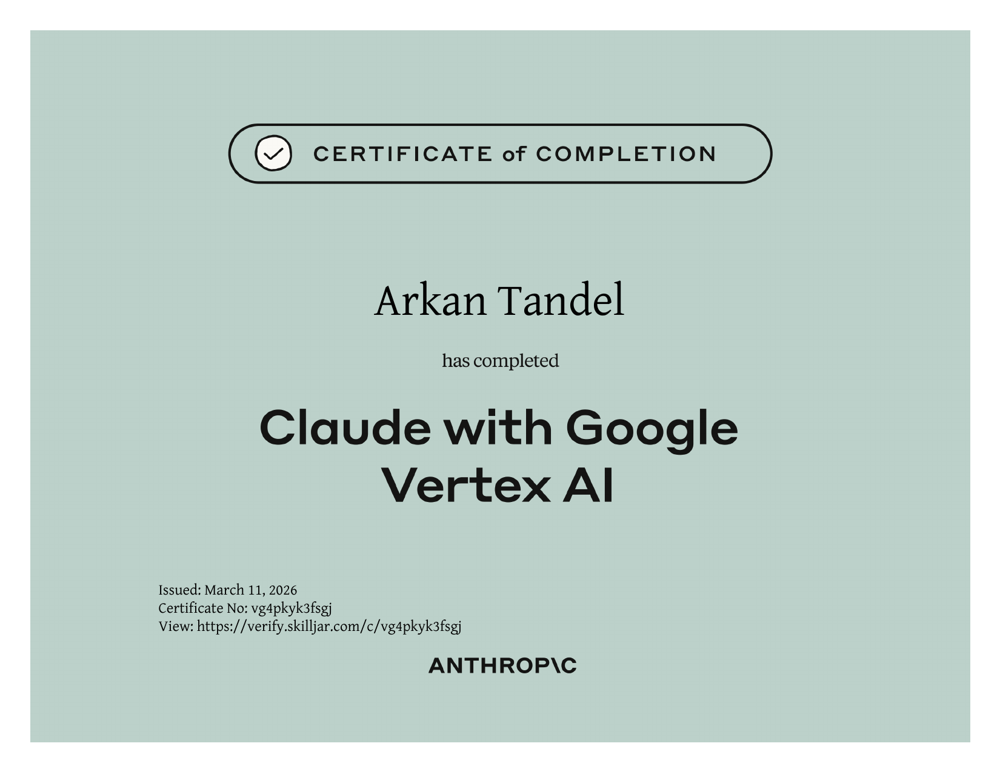
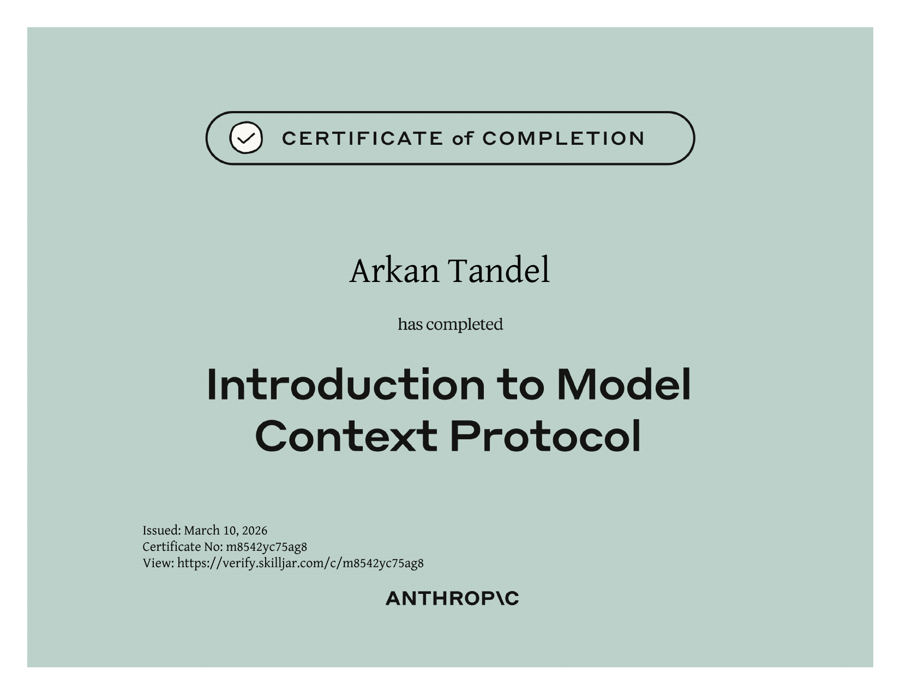
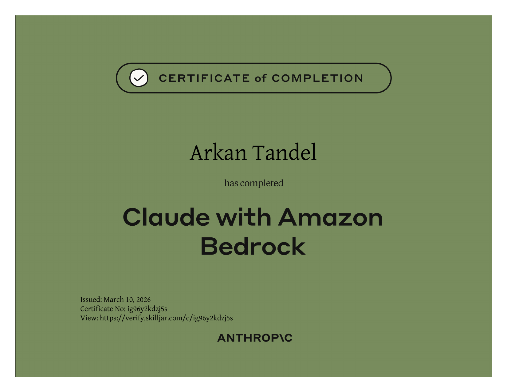
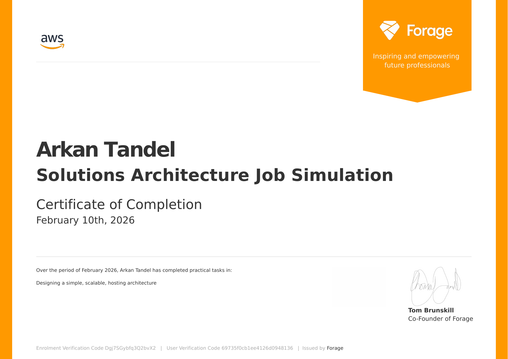

  
  &nbsp;
  

---

## 🏆 My Certifications

---

### 🟠 Claude with Google Cloud's Vertex AI
**Issuer:** Anthropic &nbsp;·&nbsp; **Date:** March 11, 2026 &nbsp;·&nbsp; **Cert No:** `vg4pkyk3fsgj`

---

### 🟣 Introduction to Model Context Protocol
**Issuer:** Anthropic &nbsp;·&nbsp; **Date:** March 10, 2026 &nbsp;·&nbsp; **Cert No:** `m8542yc75ag8`

---

### 🔵 Claude with Amazon Bedrock
**Issuer:** Anthropic &nbsp;·&nbsp; **Date:** March 10, 2026 &nbsp;·&nbsp; **Cert No:** `ig96y2kdzj5s`

---

### 🟡 AWS Solutions Architecture Job Simulation
**Issuer:** Amazon Web Services × Forage &nbsp;·&nbsp; **Date:** February 10, 2026

---

### 🟢 Deloitte Technology Job Simulation
**Issuer:** Deloitte × Forage &nbsp;·&nbsp; **Date:** February 5, 2026

📄 [View Certificate PDF](Certificates/cert_deloitte.pdf.pdf)

---

| Certification | Issuer | Date | Verify |
|---|---|---|---|
| Claude with Google Cloud Vertex AI | Anthropic | Mar 11, 2026 | [✅ Link](https://verify.skilljar.com/c/vg4pkyk3fsgj) |
| Introduction to Model Context Protocol | Anthropic | Mar 10, 2026 | [✅ Link](https://verify.skilljar.com/c/m8542yc75ag8) |
| Claude with Amazon Bedrock | Anthropic | Mar 10, 2026 | [✅ Link](https://verify.skilljar.com/c/ig96y2kdzj5s) |
| AWS Solutions Architecture Simulation | AWS × Forage | Feb 10, 2026 | ✅ Forage |
| Deloitte Technology Job Simulation | Deloitte × Forage | Feb 5, 2026 | ✅ Forage |

 

