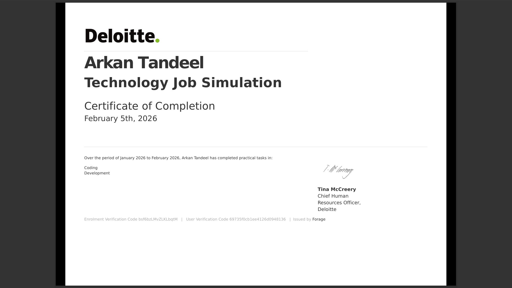

<!-- HEADER BANNER - LIGHT MODE -->

 

<!-- TYPING ANIMATION -->

  

<!-- PROFILE LINKS -->

&nbsp;&nbsp;

  

---

## 👨‍💻 About Me

> 🌟 *I'm a passionate learner on an exciting journey into **Cloud Computing** and **DevOps** — exploring the tools and technologies that power the modern digital world.*

- ☁️ **Currently Learning** — Cloud Architecture (AWS & GCP), DevOps pipelines & CI/CD
- 🤖 **Exploring** — AI integration with Anthropic Claude, MCP, Bedrock & Vertex AI
- 🛠️ **Building** — Hands-on projects that combine Cloud + AI together
- 📚 **Goal** — Become a skilled **Cloud & DevOps Engineer** who builds intelligent systems
- 💡 **Believe in** — Learning by doing, certifying, and shipping real projects

---

## 🛠️ Tech Stack & Tools

---

## 🏆 Certifications & Verified Credentials

> 🎯 **5 Verified Certifications** earned in 2026 — across **Anthropic AI**, **AWS**, **Google Cloud** & **Deloitte**

---

### 🟠 `1` — Claude with Google Cloud's Vertex AI

| 📋 Detail | ℹ️ Info |
|-----------|---------|
| 🏢 **Issuer** | Anthropic |
| 📅 **Issued** | March 11, 2026 |
| 🔑 **Cert No** | `vg4pkyk3fsgj` |
| ✅ **Verify** | [Click to Verify →](https://verify.skilljar.com/c/vg4pkyk3fsgj) |

> 💡 **What I learned:** Deploying and integrating Anthropic's Claude AI models within Google Cloud's **Vertex AI** platform — from API setup to building scalable AI pipelines on GCP infrastructure.

 

---

### 🟣 `2` — Introduction to Model Context Protocol

| 📋 Detail | ℹ️ Info |
|-----------|---------|
| 🏢 **Issuer** | Anthropic |
| 📅 **Issued** | March 10, 2026 |
| 🔑 **Cert No** | `m8542yc75ag8` |
| ✅ **Verify** | [Click to Verify →](https://verify.skilljar.com/c/m8542yc75ag8) |

> 💡 **What I learned:** The architecture of **MCP** — Anthropic's open standard for connecting AI models to external tools, APIs and databases — the future of agentic AI systems adopted across the entire industry.

 

---

### 🔵 `3` — Claude with Amazon Bedrock

| 📋 Detail | ℹ️ Info |
|-----------|---------|
| 🏢 **Issuer** | Anthropic |
| 📅 **Issued** | March 10, 2026 |
| 🔑 **Cert No** | `ig96y2kdzj5s` |
| ✅ **Verify** | [Click to Verify →](https://verify.skilljar.com/c/ig96y2kdzj5s) |

> 💡 **What I learned:** Deploying Claude via **AWS Bedrock** — calling the Claude API through AWS SDK, handling streaming responses and building enterprise-grade AI apps inside AWS infrastructure.

 

---

### 🟡 `4` — AWS Solutions Architecture Job Simulation

| 📋 Detail | ℹ️ Info |
|-----------|---------|
| 🏢 **Issuer** | Amazon Web Services × Forage |
| 📅 **Issued** | February 10, 2026 |
| 🎯 **Skills** | Scalable Hosting Architecture Design |
| ✅ **Platform** | Forage Verified |

> 💡 **What I learned:** Designing a **simple, scalable, hosting architecture** — real tasks that AWS Solutions Architects do every day, including service selection, cost optimization, and architecture diagramming.

 

---

### 🟢 `5` — Deloitte Technology Job Simulation

| 📋 Detail | ℹ️ Info |
|-----------|---------|
| 🏢 **Issuer** | Deloitte × Forage |
| 📅 **Issued** | February 5, 2026 |
| 🎯 **Skills** | Coding · Development |
| ✅ **Platform** | Forage Verified |

> 💡 **What I learned:** Real technology consulting tasks from **Deloitte** — one of the world's top Big 4 firms — including coding and development challenges modeled on real client projects. Certified by Deloitte's CHRO.

 

---

## 📊 All Certifications at a Glance

| # | 🏅 Certification | 🏢 Issuer | 📅 Date | 🔗 Verify |
|---|-----------------|-----------|---------|-----------|
| 🟠 1 | Claude with Google Cloud Vertex AI | Anthropic | Mar 11, 2026 | [✅ Verify](https://verify.skilljar.com/c/vg4pkyk3fsgj) |
| 🟣 2 | Introduction to Model Context Protocol | Anthropic | Mar 10, 2026 | [✅ Verify](https://verify.skilljar.com/c/m8542yc75ag8) |
| 🔵 3 | Claude with Amazon Bedrock | Anthropic | Mar 10, 2026 | [✅ Verify](https://verify.skilljar.com/c/ig96y2kdzj5s) |
| 🟡 4 | AWS Solutions Architecture Simulation | AWS × Forage | Feb 10, 2026 | ✅ Forage |
| 🟢 5 | Deloitte Technology Job Simulation | Deloitte × Forage | Feb 5, 2026 | ✅ Forage |

---

## 📈 GitHub Stats

&nbsp;

---

### 🌱 Currently on my Cloud & DevOps Journey...

*"The cloud is not a destination — it's a way of thinking. And I'm just getting started."* ☁️

 

&nbsp;

  

<!-- FOOTER BANNER -->

